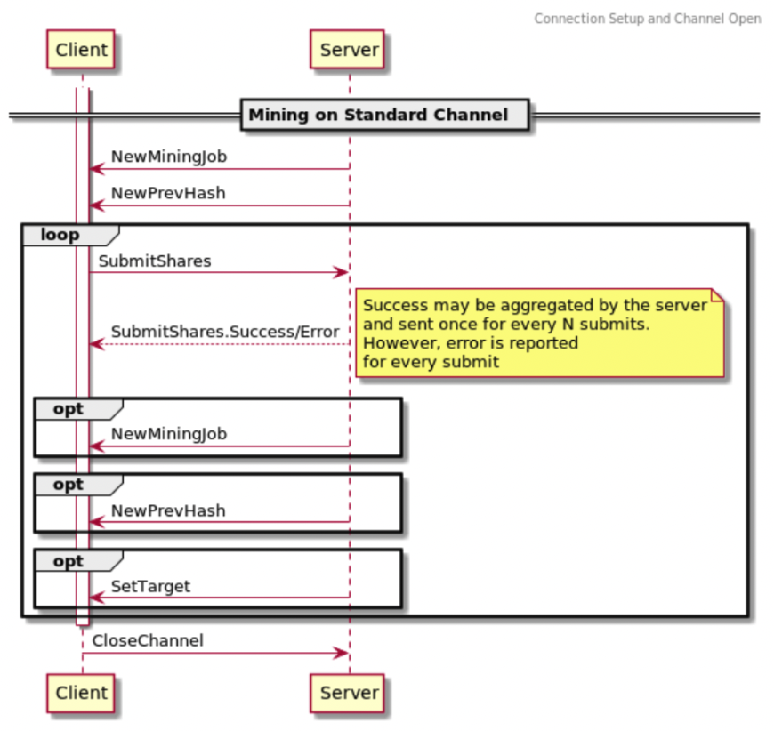

# 4. Mining Protocol


## 4.1 Channels
The protocol is designed such that downstream devices (or proxies) open communication channels with upstream stratum nodes within established connections.
The upstream stratum endpoints could be actual mining servers or proxies that pass the messages further upstream.
Each channel identifies a dedicated mining session associated with an authorized user.
Upstream stratum nodes accept work submissions and specify a mining target on a per-channel basis.

There can theoretically be up to 232 open channels within one physical connection to an upstream stratum node.
All channels are independent of each other, but share some messages broadcast from the server for higher efficiency (e.g. information about a new prevhash).
Each channel is identified by its `channel_id` (U32), which is consistent throughout the whole life of the connection.

A proxy can either transparently allow its clients to open separate channels with the server (preferred behavior) or aggregate open connections from downstream devices into its own open channel with the server and translate the messages accordingly (present mainly for allowing v1 proxies).
Both options have some practical use cases.
In either case, proxies SHOULD aggregate clients' channels into a smaller number of TCP connections.
This saves network traffic for broadcast messages sent by a server because fewer messages need to be sent in total, which leads to lower latencies as a result.
And it further increases efficiency by allowing larger packets to be sent.

The protocol defines three types of channels: **standard channels**, **extended channels** (mining sessions) and **group channels** (organizational), which are useful for different purposes.

The main difference between standard and extended channels is that standard channels cannot manipulate the coinbase transaction / Merkle path, as they operate solely on provided Merkle roots.
We call this header-only mining.
Extended channels, on the other hand, are given extensive control over the search space so that they can implement various advanced use cases such as translation between v1 and v2 protocols, difficulty aggregation, custom search space splitting, etc.

This separation vastly simplifies the protocol implementation for clients that don’t support extended channels, as they only need to implement the subset of protocol messages related to standard channels (see Mining Protocol Messages for details).


### 4.1.1 Standard Channels
Standard channels are intended to be used by end mining devices. 

The size of the search space for one standard channel (header-only mining) for one particular value in the `nTime` field is `2^(NONCE_BITS + VERSION_ROLLING_BITS) = ~280Th`, where `NONCE_BITS = 32` and `VERSION_ROLLING_BITS = 16`.
This is a guaranteed space before `nTime` rolling (or changing the Merkle root). 

The protocol dedicates all directly modifiable bits (`version`, `nonce`, and `nTime`) from the block header to one mining channel.
This is the smallest assignable unit of search space by the protocol.
The client which opened the particular channel owns the whole assigned space and can split it further if necessary (e.g. for multiple hashing boards and for individual chips etc.).


### 4.1.2 Extended Channels
Extended channels are intended to be used by proxies.
Upstream servers which accept connections and provide work MUST support extended channels.
Clients, on the other hand, do not have to support extended channels, as they MAY be implemented more simply with only standard channels at the end-device level.
Thus, upstream servers providing work MUST also support standard channels.

The size of search space for an extended channel is `2^(NONCE_BITS+VERSION_ROLLING_BITS+extranonce_size*8)` per `nTime` value.


### 4.1.3 Group Channels
Standard channels opened within one particular connection can be grouped together to be addressable by a common communication group channel.

Whenever a standard channel is created it is always put into some channel group identified by its `group_channel_id`.
Group channel ID namespace is the same as channel ID namespace on a particular connection but the values chosen for group channel IDs must be distinct. 


### 4.1.4 Future Jobs
An empty future block job or speculated non-empty job can be sent in advance to speedup new mining job distribution.
The point is that the mining server MAY have precomputed such a job and is able to pre-distribute it for all active channels.
The only missing information to start to mine on the new block is the new prevhash.
This information can be provided independently.

Such an approach improves the efficiency of the protocol where the upstream node does not waste precious time immediately after a new block is found in the network.


## 4.2 Hashing Space Distribution
Each mining device has to work on a unique part of the whole search space.
The full search space is defined in part by valid values in the following block header fields:

- Nonce header field (32 bits)
- Version header field (16 bits, as specified by [BIP 320](https://github.com/bitcoin/bips/blob/master/bip-0320.mediawiki))
- Timestamp header field 

The other portion of the block header that’s used to define the full search space is the Merkle root hash of all transactions in the block, projected to the last variable field in the block header:

- Merkle root, deterministically computed from:
  - Coinbase transaction: typically 4-8 bytes, possibly much more.
  - Transaction set: practically unbounded space.
    All roles in Stratum v2 MUST NOT use transaction selection/ordering for additional hash space extension.
    This stems both from the concept that miners/pools should be able to choose their transaction set freely without any interference with the protocol, and also to enable future protocol modifications to Bitcoin.
    In other words, any rules imposed on transaction selection/ordering by miners not described in the rest of this document may result in invalid work/blocks.

Mining servers MUST assign a unique subset of the search space to each connection/channel (and therefore each mining device) frequently and rapidly enough so that the mining devices are not running out of search space.
Unique jobs can be generated regularly by: 

- Putting unique data into the coinbase for each connection/channel, and/or 
- Using unique work from a work provider, e.g. a previous work update (note that this is likely more difficult to implement, especially in light of the requirement that transaction selection/ordering not be used explicitly for additional hash space distribution).

This protocol explicitly expects that upstream server software is able to manage the size of the hashing space correctly for its clients and can provide new jobs quickly enough.


## 4.3 Mining Protocol Messages
  
Figure 4.3.a Mining Protocol Messages: Initialization

  
Figure 4.3.b Mining Protocol Messages: Mining on Standard Channel

### 4.3.1 SetupConnection Flags for Mining Protocol
Flags usable in `SetupConnection.flags` and `SetupConnection.Error::flags`:

```
+--------------------------+-----+-------------------------------------------------------------------------------------+
| Field Name               | Bit | Description                                                                         |
+--------------------------+-----+-------------------------------------------------------------------------------------+
| REQUIRES_VERSION_ROLLING | 0   | The downstream node requires standard jobs. It does not understand group channels - |
|                          |     | it is unable to process extended jobs sent to standard channels through a group     |
|                          |     | channel.                                                                            |
+--------------------------+-----+-------------------------------------------------------------------------------------+
| REQUIRES_WORK_SELECTION  | 1   | If set to 1, the client notifies the server that it will send SetCustomMiningJob on |
|                          |     | this connection.                                                                    |
+--------------------------+-----+-------------------------------------------------------------------------------------+
| REQUIRES_VERSION_ROLLING | 2   | The client requires version rolling for efficiency or correct operation and the     |
|                          |     | server MUST NOT send jobs which do not allow version rolling.                       |
+--------------------------+-----+-------------------------------------------------------------------------------------+
```

Flags usable in `SetupConnection.Success.flags`:
```
+----------------------------+-----+-----------------------------------------------------------------------------------+
| Field Name                 | Bit | Description                                                                       |
+----------------------------+-----+-----------------------------------------------------------------------------------+
| REQUIRES_FIXED_VERSION     | 0   | Upstream node will not accept any changes to the version field. Note that if      |
|                            |     | REQUIRES_VERSION_ROLLING was set in the SetupConnection::flags field, this bit    |
|                            |     | MUST NOT be set. Further, if this bit is set, extended jobs MUST NOT indicate     |
|                            |     | support for version rolling.                                                      |
+----------------------------+-----+-----------------------------------------------------------------------------------+
| REQUIRES_EXTENDED_CHANNELS | 1   | Upstream node will not accept opening of a standard channel.                      |
+----------------------------+-----+-----------------------------------------------------------------------------------+
```


### 4.3.2 OpenStandardMiningChannel (Client -> Server)
This message requests to open a standard channel to the upstream node.

After receiving a `SetupConnection.Success` message, the client SHOULD respond by opening channels on the connection.
If no channels are opened within a reasonable period the server SHOULD close the connection for inactivity.

Every client SHOULD start its communication with an upstream node by opening a channel, which is necessary for almost all later communication.
The upstream node either passes opening the channel further or has enough local information to handle channel opening on its own (this is mainly intended for v1 proxies).
Clients must also communicate information about their hashing power in order to receive well-calibrated job assignments.

```
+-------------------+-----------+----------------------------------------------------------------------------------------+
| Field Name        | Data Type | Description                                                                            |
+-------------------+-----------+----------------------------------------------------------------------------------------+
| request_id        | U32       | Client-specified identifier for matching responses from upstream server. The value     |
|                   |           | MUST be connection-wide unique and is not interpreted by the server.                   |
+-------------------+-----------+----------------------------------------------------------------------------------------+
| user_identity     | STR0_255  | Unconstrained sequence of bytes. Whatever is needed by upstream node to                |
|                   |           | identify/authenticate the client, e.g. "braiinstest.worker1". Additional restrictions  |
|                   |           | can be imposed by the upstream node (e.g. a pool). It is highly recommended that UTF-8 |
|                   |           | encoding is used.                                                                      |
+-------------------+-----------+----------------------------------------------------------------------------------------+
| nominal_hash_rate | F32       | [h/s] Expected hash rate of the device (or cumulative hashrate on the channel if       |
|                   |           | multiple devices are connected downstream) in h/s. Depending on server's target        |
|                   |           | setting policy, this value can be used for setting a reasonable target for the         |
|                   |           | channel. Proxy MUST send 0.0f when there are no mining devices connected yet.          |
+-------------------+-----------+----------------------------------------------------------------------------------------+
| max_target        | U256      | Maximum target which can be accepted by the connected device or devices. Server MUST   |
|                   |           | accept the target or respond by sending OpenMiningChannel.Error message.               |
+-------------------+-----------+----------------------------------------------------------------------------------------+
```


### 4.3.3 OpenStandardMiningChannel.Success (Server -> Client)
Sent as a response for opening a standard channel, if successful.

```
+-------------------+-----------+----------------------------------------------------------------------------------------+
| Field Name        | Data Type | Description                                                                            |
+-------------------+-----------+----------------------------------------------------------------------------------------+
| request_id        | U32       | Client-specified request ID from OpenStandardMiningChannel message, so that the client |
|                   |           | can pair responses with open channel requests.                                         |
+-------------------+-----------+----------------------------------------------------------------------------------------+
| channel_id        | U32       | Newly assigned identifier of the channel, stable for the whole lifetime of the         |
|                   |           | connection. E.g. it is used for broadcasting new jobs by NewExtendedMiningJob.         |
+-------------------+-----------+----------------------------------------------------------------------------------------+
| target            | U256      | Initial target for the mining channel.                                                 |
+-------------------+-----------+----------------------------------------------------------------------------------------+
| extranonce_prefix | U32       | Bytes used as implicit first part of extranonce for the scenario when extended job is  |
|                   |           | served by the upstream node for a set of standard channels that belong to the same     |
|                   |           | group.                                                                                 |
+-------------------+-----------+----------------------------------------------------------------------------------------+
| group_channel_id  | U32       | Group channel into which the new channel belongs. See SetGroupChannel for details.     |
+-------------------+-----------+----------------------------------------------------------------------------------------+
```
